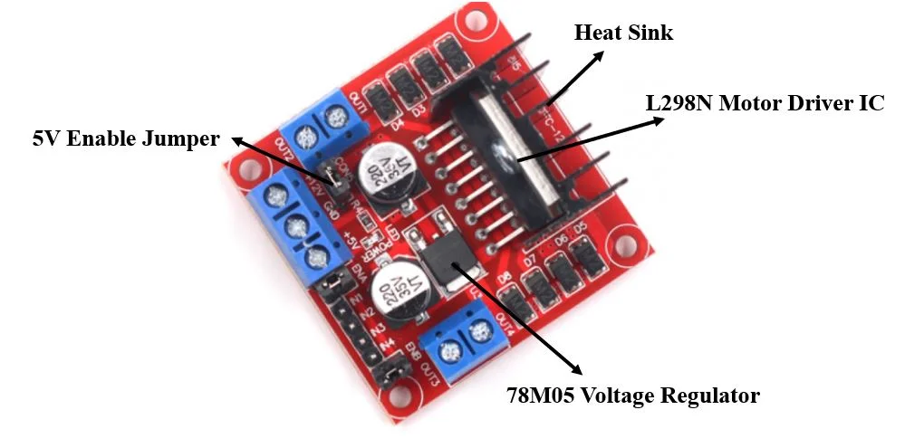
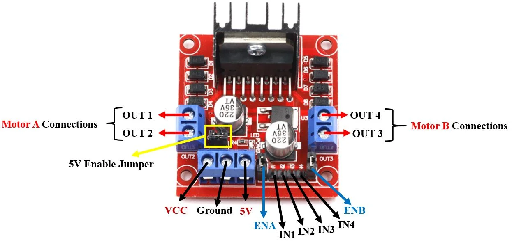
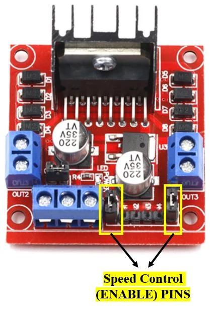
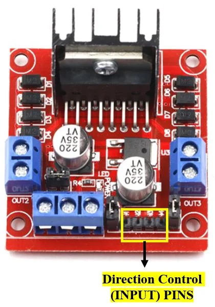

# L298N Motor Driver Module

## Overview
The L298N motor driver module consists of a L298N motor driver IC ,78M05 5V regulator, 5V jumper enable, power LED, heat sink, resistors and capacitors all combined in an integrated circuit. The diagram below shows all the components consisting inside the module.

It is a dual channel H bridge motor driver which can be easily used to drive two motors.

The 5V pin in this case acts as an output to power the microcontroller

If the power supply is more than 12V, make sure the jumper is not intact and supply 5V power through the pin separately.

| Driver Model                 | L298N                 |
|------------------------------|-----------------------|
| Driver Chip                  | Double H-bridge L298N |
| Maximum Power                | 25W                   |
| Maximum Motor Supply Voltage | 46V                   |
| Maximum Motor Supply Current | 2A                    |
| Driver Voltage               | 5-35V                 |
| Driver Current               | 2A                    |
| Size                         | 43x43x26mm            |

## PinOut

| Pin Name    | Description                                                                                                                                                                        |
|-------------|------------------------------------------------------------------------------------------------------------------------------------------------------------------------------------|
| VCC         | This is the pin which supplies power to the motor. It is imprinted with +12V on board but can be powered between 6-12V.                                                            |
| Ground      | This is the common ground pin.                                                                                                                                                     |
| 5V          | This pin supplies the power (5V) for the internal circuit (L298N IC). Will be used only if the 5V enable jumper is not intact. If jumper is intact, then it acts as an output pin. |
| ENA         | This pin controls the speed of the motor A by enabling the PWM signal.                                                                                                             |
| IN1 & IN2   | These are the input pins for motor A. They control the spinning direction for that particular motor.                                                                               |
| IN3 & IN4   | These are the input pins for motor B. They control the spinning direction for that particular motor.                                                                               |
| ENB         | This pin controls the speed of the motor B by enabling the PWM signal.                                                                                                             |
| OUT1 & OUT2 | OUT1: Positive terminal. OUT2: Negative terminal  These are the output pins for motor A. Motor A having voltage between 5-35V, will be connected through these two terminals.      |
| OUT3 & OUT4 | OUT3: Positive terminal OUT4: Negative terminal  These are the output pins for motor B.                                                                                            |

## Controlling DC motors through L298N module and MicroPython

### Control Pins
One type controls the speed and the other type controls the direction of the motor.

Speed Control (ENABLE) Pins
The speed control pins labelled ENA and ENB on the module, control the speed of the dc motor and turn it ON and OFF.

- ENA controls the speed of motor A and ENB controls the speed of motor B. 
- If both of the pins are in a logic HIGH (5V) state, then both the motors are ON and spinning at maximum speed. 
- If both of the pins are in a logic LOW (ground) state, then both the motors are OFF.
- Through the PWM functionality we can also control the speed of the motor
- By default, there is a jumper connected on these pins which keeps these pins in a HIGH state. 
- In order to control the speed, we need to remove the jumper and connect these terminals with the PWM pins of ESP32/ESP8266 and program them in code

### Direction Control (INPUT) Pins

The direction control pins are the four input pins (IN1, IN2, IN3, IN4) on the module.

- Through these input pins we can determine whether to move the dc motor forward or backwards.
- IN1 and IN2 control motor A’s spinning direction whereas IN3 and IN4 control motor B’s spinning direction
- The table below shows the logic signals required for the appropriate spinning action for motor A.

| IN1      | IN2     | Motor Action |
|----------|---------|--------------|
| 1 (HIGH) | 1       | OFF          |
| 1        | 0 (LOW) | Backward     |
| 0        | 1       | Forward      |
| 0        | 0       | OFF          |

